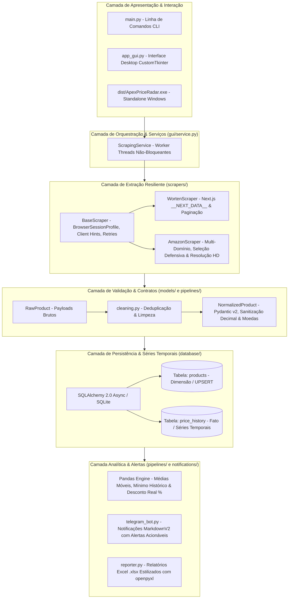

# 🚀 ApexPrice Radar & Engine: Automação, Scraping & Inteligência de Preços


[](https://www.python.org/)
[](https://astral.sh/uv)
[](https://github.com/astral-sh/ruff)
[](https://mypy-lang.org/)
[](https://docs.pytest.org/)
[](LICENSE)

> **Solução completa de engenharia de dados, web scraping resiliente e monitorização de mercado em tempo real focada no setor de tecnologia e eletrónica (Worten & Amazon).**  
> Combina uma arquitetura modular assíncrona orientada a objetos (Clean Architecture), persistência de séries temporais (SQLAlchemy 2.0 Async), validação com Pydantic v2, relatórios analíticos (Pandas/Excel), alertas via Telegram e uma **aplicação desktop moderna em CustomTkinter pronta a ser compilada como executável autónomo (`.exe`)**.

---

## 📑 Índice Detalhado

1. [🎯 O Propósito do Projeto](#1--o-propósito-do-projeto)
2. [🏛️ Arquitetura do Sistema](#2-️-arquitetura-do-sistema)
3. [🕵️ Engenharia de Scraping & Estratégias Anti-Bloqueio](#3-️-engenharia-de-scraping--estratégias-anti-bloqueio)
   - [Scraper Worten (Next.js De-hydration)](#-scraper-worten-nextjs-de-hydration)
   - [Scraper Amazon (Multi-Domínio & Dynamic Image Parsing)](#-scraper-amazon-multi-domínio--dynamic-image-parsing)
   - [BaseScraper Resiliente & Identidade Persistente](#-basescraper-resiliente--identidade-persistente)
4. [🔄 Pipeline de Dados, Séries Temporais & Métricas](#4--pipeline-de-dados-séries-temporais--métricas)
5. [🖥️ Aplicação Desktop GUI (CustomTkinter)](#5-️-aplicação-desktop-gui-customtkinter)
6. [📦 Executável Autónomo Windows (.exe)](#6--executável-autónomo-windows-exe)
7. [📊 Relatórios Executivos & Alertas Telegram](#7--relatórios-executivos--alertas-telegram)
8. [📂 Estrutura do Repositório](#8--estrutura-do-repositório)
9. [⚡ Guia de Instalação e Execução Passo a Passo](#9--guia-de-instalação-e-execução-passo-a-passo)
10. [🧪 Qualidade de Código & Testes Unitários](#10--qualidade-de-código--testes-unitários)

---

## 1. 🎯 O Propósito do Projeto

No comércio eletrónico de tecnologia, a volatilidade de preços e as "falsas promoções" (onde os preços sobem antes de descer para simular descontos artificiais) são frequentes. O **ApexPrice Radar** foi concebido para resolver três desafios principais:

1. **Inteligência de Mercado Real:** Recolher o histórico contínuo de preços de produtos para calcular o **desconto real** face à média histórica móvel e alertar quando um produto atinge o seu **mínimo histórico absoluto** (*All-Time Low*).
2. **Resiliência Extrema contra Bloqueios:** As grandes plataformas de comércio aplicam Firewalls de Aplicação Web (WAFs) como Cloudflare, Akamai e Amazon Shield. Este projeto implementa perfis de sessão coerentes, Client Hints reais, evasão de CAPTCHA e backoff exponencial com jitter para garantir continuidade operacional.
3. **Acessibilidade para Qualquer Utilizador:** Para além da interface de linha de comandos (CLI) voltada para automações em servidores, o projeto disponibiliza uma **interface gráfica desktop nativa moderna** e um **executável autónomo (`.exe`)** que corre em qualquer computador Windows com duplo clique, sem exigir conhecimento técnico nem instalação de Python.

---

## 2. 🏛️ Arquitetura do Sistema

O projeto adota os princípios de **Clean Architecture**, **Separação de Responsabilidades (SRP)** e **Idempotência de Dados**:



---

## 3. 🕵️ Engenharia de Scraping & Estratégias Anti-Bloqueio

### 🛒 Scraper Worten (`Next.js De-hydration`)
* **Extração Direta de Estado Inicial:** Em vez de analisar nós HTML mutáveis ou executar browsers pesados (Puppeteer/Playwright), o scraper extrai o JSON canónico serializado na tag `<script id="__NEXT_DATA__">`.
* **Imunidade a Mudanças de Layout:** Garante que alterações cosméticas no CSS do site não quebrem a extração de dados.
* **Paginação Robusta de Categorias:** Suporta tanto termos de pesquisa genéricos como URLs de categorias inteiras (ex.: `/informatica-e-acessorios/monitores`), navegando de forma automatizada através dos parâmetros de página (`?page=1, 2, 3...`) até satisfazer o limite de itens pretendido.
* **Prevenção de Preços Concatenações:** Tratamento dedicado para produtos em promoção, isolando o preço promocional do preço de base sem poluição de caracteres.

### 📦 Scraper Amazon (`Multi-Domínio & Dynamic Image Parsing`)
* **Suporte Multi-Domínio:** Aceita URLs de qualquer mercado da Amazon (`amazon.es`, `amazon.com`, `amazon.de`, `amazon.co.uk`, etc.), configurando automaticamente cabeçalhos de idioma e moeda.
* **Extração de Imagens de Alta Resolução:** Analisa o atributo `data-a-dynamic-image` embutido nos nós da imagem e extrai a versão com maior resolução física em píxeis.
* **Isolamento de Preços em Promoção:** Decompõe os seletores `.basisPrice` e `.a-text-price` para evitar a concatenação do preço riscado com o preço real de venda.
* **Paginação Multi-Página:** Suporta pesquisa com paginação automática (`&page=1, 2, 3...`) e extração de páginas de categorias ou bestsellers (`/b/`, `/gp/bestsellers/`).
* **Deteção Ativa de CAPTCHA:** Identifica páginas de Robot Check da Amazon e aciona a renovação imediata de identidade.

### 🛡️ BaseScraper Resiliente & Identidade Persistente
* **Perfil de Navegação Coerente (`BrowserSessionProfile`):** Mitiga o erro clássico de alternar aleatoriamente o User-Agent a cada requisição. O scraper mantém uma identidade estável, alinhando rigorosamente o `User-Agent` aos cabeçalhos de Client Hints modernos (`sec-ch-ua`, `sec-ch-ua-mobile`, `sec-ch-ua-platform`).
* **Auto-Rotação em Caso de Bloqueio (`rotate_identity`):** Caso um endpoint devolva códigos `403`, `429` ou um desafio anti-bot, a sessão descarta a identidade atual, limpa cookies e inicia um novo perfil de navegador.
* **Resiliência com Tenacity:** Implementa *Exponential Backoff* com *Full Jitter*, prevenindo sobrecarga de requisições e resolvendo erros transitórios de rede.
* **Utilitários de Extração Rápidos:** Helpers nativos como `fetch_soup()`, `extract_json_ld()` (leitura de Schema.org) e `clean_text()`.

---

## 4. 🔄 Pipeline de Dados, Séries Temporais & Métricas

### Contratos Estritos com Pydantic v2
Toda a informação bruta recolhida passa por modelos de validação tipados:
* Conversão e sanitização de preços para `Decimal` com precisão de 2 casas decimais (eliminando imprecisões de arredondamento inerentes a números de vírgula flutuante).
* Validação de URLs canónicos, disponibilidade em stock (`IN_STOCK`, `OUT_OF_STOCK`, `PRE_ORDER`) e retalhistas suportados.

### Esquema Relacional de Séries Temporais (SQLAlchemy 2.0 Async)
Os dados são persistidos segundo uma modelagem inspirada no Esquema Estrela:
* **Tabela `products` (Dimensão):** Chave primária natural `(retailer, sku)`. Regista a identidade do produto, título, marca, categoria e URL canónico, atualizada via **UPSERT idempotente**.
* **Tabela `price_history` (Fato):** Série temporal cronológica que guarda cada observação de preço, preço promocional, disponibilidade e timestamp com precisão de microssegundos.

### Métricas Analíticas Calculadas (Pandas)
* **Média Móvel Histórica ($\bar{P}$):** Preço médio do produto ao longo de todas as observações registadas.
* **Mínimo Histórico Absoluto (`is_all_time_low`):** Sinalizador booleano ativado quando o preço atual é o mais baixo de sempre na base de dados.
* **Desconto Real Percentual:**
  $$\text{Desconto Real (\%)} = \left(\frac{\bar{P}_{\text{histórico}} - P_{\text{atual}}}{\bar{P}_{\text{histórico}}}\right) \times 100$$

---

## 5. 🖥️ Aplicação Desktop GUI (CustomTkinter)

Para além do pipeline de servidor, o projeto inclui uma aplicação desktop nativa moderna:

 *(exemplo ilustrativo)*

### Destaques da Interface:
* **Tema Dark Blue Moderno:** Design escuro ergonómico com contrastes estudados e tipografia limpa.
* **Entrada Inteligente com Auto-Deteção:** Campo de entrada com deteção automática de loja:
  * Cola um URL de produto ou categoria (Worten ou Amazon) ou digita um termo de pesquisa (ex.: `"Monitor 144Hz"`, `"RTX 4070"`).
* **Seletor de Quantidade de Itens:** Permite definir facilmente o limite de extração: **25, 50, 100, 200 ou 500 produtos**.
* **Thread em Segundo Plano Não-Bloqueante:** O processo de scraping e parsing corre numa thread de trabalho isolada (`threading.Thread`), comunicando com a interface via `app.after()`, garantindo que a janela **nunca congela ou fica "Sem Resposta"**.
* **Cartões de Métricas Dinâmicos:** Apresenta em tempo real:
  * 📦 **Total de Produtos** recolhidos.
  * 💰 **Preço Médio** dos itens em exibição.
  * 🏷️ **Menor Preço** encontrado no lote.
* **Tabela Dinâmica Interativa:** Lista com scroll suave, mostrando imagem, título, loja, preço atualizado, disponibilidade e botões para abrir a hiperligação no navegador ou remover o item.
* **Exportação com 1 Clique:**
  * **Exportar para Excel (.xlsx):** Gera folhas de cálculo corporativas estilizadas.
  * **Exportar para CSV (.csv):** Gera ficheiro UTF-8 com BOM (compatibilidade nativa com o Microsoft Excel em português).

---

## 6. 📦 Executável Autónomo Windows (.exe)

O projeto está pronto para ser compilado e distribuído como um único ficheiro executável autónomo para Windows (`.exe` *one-file*):

### Onde se encontra o executável compilado:
```text
dist/ApexPriceRadar.exe
```

### Características do Executável:
* **Autónomo (*Standalone*):** Contém internamente o interpretador Python e todas as bibliotecas necessárias. Não necessita que o utilizador instale Python, `pip` ou qualquer dependência.
* **Sem Consola (*Windowed*):** Inicia diretamente a interface gráfica moderna sem abrir a janela preta da linha de comandos do Windows.
* **Inclusão Total de Recursos:** Configurado para incluir os temas (`.json`), fontes e imagens do CustomTkinter, prevenindo erros de ficheiros em falta.

### Como Recompilar o Executável:
Podes usar o script automatizado incluído no projeto:
```bash
uv run python build_exe.py
```
Ou executar diretamente através do PyInstaller:
```bash
uv run pyinstaller --noconfirm --onefile --windowed --name="ApexPriceRadar" --collect-all=customtkinter --hidden-import=openpyxl --hidden-import=pandas --hidden-import=sqlalchemy --hidden-import=aiosqlite --hidden-import=tenacity --hidden-import=fake_useragent --hidden-import=bs4 --hidden-import=httpx app_gui.py
```

---

## 7. 📊 Relatórios Executivos & Alertas Telegram

### Alertas em Tempo Real no Telegram
Quando um produto atinge o limiar mínimo de desconto configurado (ex.: 10% abaixo da média), o bot envia um alerta formatado em `MarkdownV2`:

```text
🔥 OPORTUNIDADE DE PREÇO DETETADA 🔥

📦 Produto: Monitor Gaming LG UltraGear 27" IPS 144Hz
🏪 Loja: Worten
💰 Preço Atual: €179.99
📊 Média Histórica: €229.90
📉 Desconto Real: 21.7%
⭐ Mínimo Histórico: SIM

🔗 Ver Oferta na Loja
```

### Relatório em Excel (.xlsx) Profissional
Gerado via `openpyxl` com formatação corporativa:
* Cabeçalhos azuis (`#1F4E78`) com fontes `Segoe UI` e grelhas bem delineadas.
* Formatação nativa de células para moeda (`€ #,##0.00`) e percentagens.
* Realce condicional de cores (verde suave para descontos, vermelho para produtos esgotados).
* Auto-ajuste inteligente de largura de colunas.

---

## 8. 📂 Estrutura do Repositório

```text
Ferramenta de Automação & Web Scraping em Python/
├── .github/
│   └── workflows/
│       └── ci.yml               # Pipeline de Integração Contínua (Lint, Types, Tests)
├── config/
│   ├── __init__.py
│   └── settings.py              # Definições centrais validadas com Pydantic Settings
├── database/
│   ├── __init__.py
│   ├── connection.py            # AsyncEngine e SessionMaker (SQLAlchemy 2.0)
│   ├── models.py                # Tabelas ORM: ProductRecord e PriceRecord
│   └── repository.py            # Repositório assíncrono para UPSERT e consultas
├── dist/
│   └── ApexPriceRadar.exe       # Ficheiro executável Windows autónomo
├── gui/
│   ├── __init__.py
│   ├── app.py                   # Interface Gráfica desktop com CustomTkinter
│   └── service.py               # Orquestrador assíncrono e thread worker da GUI
├── models/
│   ├── __init__.py
│   ├── enums.py                 # RetailerEnum, AvailabilityStatus, CategoryEnum
│   └── product.py               # Contratos Pydantic: RawProduct e NormalizedProduct
├── notifications/
│   ├── __init__.py
│   ├── reporter.py              # Gerador de relatórios Excel formatados (.xlsx)
│   └── telegram_bot.py          # Notificador assíncrono para Telegram (MarkdownV2)
├── pipelines/
│   ├── __init__.py
│   ├── cleaning.py              # Normalização de dados, regex e deduplicação
│   └── metrics.py               # Cálculo de métricas analíticas e séries com Pandas
├── scrapers/
│   ├── __init__.py
│   ├── base.py                  # BaseScraper assíncrono com gestão de sessão e retries
│   ├── amazon.py                # Scraper Amazon (multi-domínio, imagens HD, paginação)
│   └── worten.py                # Scraper Worten (__NEXT_DATA__ extraction e paginação)
├── tests/
│   ├── conftest.py              # Fixtures, SQLite em memória e mocks
│   ├── test_gui_service.py      # Testes da camada de serviço da GUI
│   ├── test_models.py           # Testes dos contratos Pydantic
│   ├── test_notifications.py   # Testes do gerador de Excel e bot Telegram
│   ├── test_pipelines.py        # Testes de limpeza de dados e métricas Pandas
│   ├── test_repository.py       # Testes de persistência relacional assíncrona
│   └── test_scrapers.py         # Testes de scraping com mocks HTTP (respx)
├── .env.example                 # Exemplo de configuração de variáveis de ambiente
├── ApexPriceRadar.spec          # Ficheiro de especificação do PyInstaller
├── app_gui.py                   # Entrypoint da Aplicação Desktop GUI
├── build_exe.py                 # Script de compilação automatizada do .exe
├── Dockerfile                   # Build multi-stage para deployment em contentores
├── Makefile                     # Atalhos de automação (run, test, lint, format, gui)
├── main.py                      # Entrypoint da Linha de Comandos (CLI)
└── pyproject.toml               # Configuração do projeto e dependências (uv)
```

---

## 9. ⚡ Guia de Instalação e Execução Passo a Passo

### Pré-requisitos
* **Python 3.12+** instalado no sistema.
* Gerenciador de pacotes ultrarrápido **uv** ([Como instalar o uv](https://astral.sh/uv)).

### 1. Clonar e Instalar o Ambiente
```bash
# Sincroniza o ambiente virtual (.venv) e instala todas as dependências
uv sync --all-extras
```

### 2. Configurar o Ficheiro de Ambiente
Cria o teu ficheiro `.env` a partir do modelo disponibilizado:
```bash
cp .env.example .env
```
*(Opcional: edita o `.env` para inserir o teu Token do Telegram caso pretendas receber notificações de desconto no telemóvel).*

### 3. Opção A: Executar a Aplicação Desktop Visual
Podes iniciar a interface gráfica diretamente com o comando:
```bash
uv run python app_gui.py
```
*(ou simplesmente executar com `make gui`).*

### 4. Opção B: Executar via Linha de Comandos (CLI)
Podes correr o motor automatizado em background ou via agendamento cron:
```bash
# Pesquisar termos em todas as lojas simultaneamente
uv run python main.py --query "PlayStation 5,MacBook Air" --retailer all

# Monitorizar apenas a Worten
uv run python main.py --query "Monitores" --retailer worten

# Monitorizar a Amazon sem exportar ficheiro Excel
uv run python main.py --query "RTX 4070" --retailer amazon --no-excel
```

---

## 10. 🧪 Qualidade de Código & Testes Unitários

O projeto está 100% coberto por verificações estáticas de tipo, formatação e testes unitários com mocks de rede:

```bash
# 1. Executar todos os testes automatizados
uv run pytest

# 2. Verificar conformidade com o linter Ruff (0 erros)
uv run ruff check .

# 3. Formatação automática de código
uv run ruff format .

# 4. Verificação estrita de tipagem estática Mypy (0 erros em 33 ficheiros)
uv run mypy .
```

---

## 📄 Licença
Distribuído sob a licença **MIT**. Consulta o ficheiro `LICENSE` para obteres informações completas.
